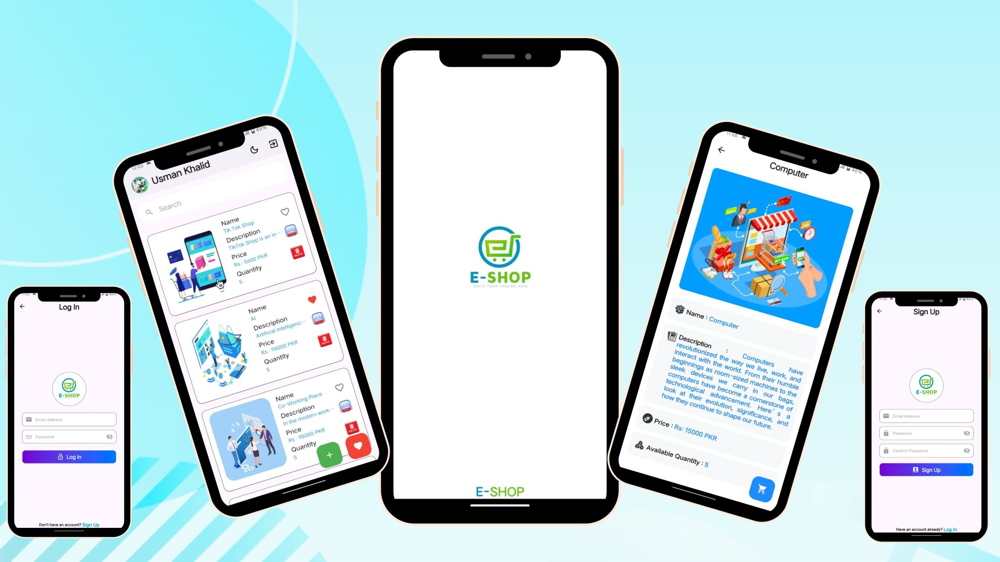
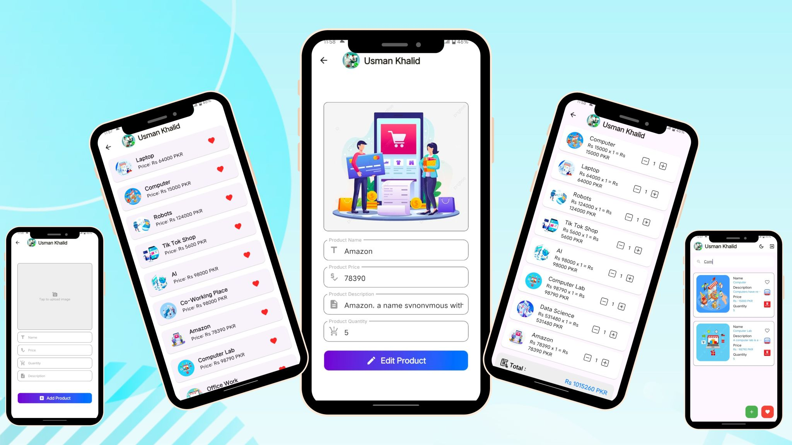

# 🛒 E-Shop — Offline First E-Commerce App

## 📱 About The Project

E-Shop is a modern offline-first E-Commerce mobile application developed using Flutter, designed to provide a fast, smooth, and fully functional shopping experience without requiring a backend server.

The application uses local storage technologies like Hive and Sqflite to manage products, cart data, favorites, and user information efficiently while ensuring instant UI updates and high performance.

Built with clean architecture and responsive UI principles, E-Shop demonstrates how powerful and scalable offline mobile applications can be created using Flutter.

---

# 🌟 Project Highlights

- 🛒 Offline First E-Commerce System
- 📦 Product CRUD Operations
- ❤️ Favorites Management
- 🛍️ Shopping Cart Functionality
- 👤 Profile Update System
- ⚡ Instant UI Synchronization
- 💾 Hive & Sqflite Local Storage
- 📱 Responsive Flutter UI

---

# ✨ Key Features

## 🛍️ Product Management

Users can:

- Add products
- Edit product details
- Delete products
- Upload product images
- Manage inventory locally

The app performs all operations instantly without requiring internet connectivity.

---

## 🛒 Shopping Cart System

The application includes a complete cart management system with:

- Add to cart
- Remove from cart
- Quantity management
- Instant price updates

---

## ❤️ Favorites Functionality

Users can save and manage favorite products for quick access and personalized shopping experience.

---

## 👤 User Profile Management

The app allows users to:

- Update profile information
- Manage account details
- Store user data securely on device

---

## ⚡ State Management & Performance

The application uses Provider/GetX for:

- Instant UI synchronization
- Smooth state management
- Fast rendering
- Better app scalability

---

# 💾 Offline Storage System

E-Shop integrates:

- Hive Database
- Sqflite Local Storage

to ensure:

- Offline accessibility
- Fast data retrieval
- Reliable local persistence
- No dependency on external servers

---

# 🛠️ Tech Stack

| Technology | Usage |
|------------|-------|
| Flutter | Frontend Development |
| Dart | Programming Language |
| Hive | Local Database |
| Sqflite | Offline Storage |
| Provider / GetX | State Management |
| VS Code | Development Environment |

---

# 🎯 Project Objectives

The project was built to:

- Demonstrate offline-first architecture
- Practice local database management
- Build scalable Flutter applications
- Deliver smooth e-commerce experience without backend dependency

---

# 📱 Application Screenshots

---

# 🚀 Future Improvements

- Online Payment Integration
- Cloud Backup Support
- Order History System
- Push Notifications
- Dark Mode Support
- Product Search & Filters

---

# 🤝 Let’s Connect

Open for Flutter development, freelance projects, and remote opportunities.

📩 Feel free to connect through GitHub or LinkedIn.

---

# ⭐ Support

If you like this project, don't forget to star the repository ⭐
